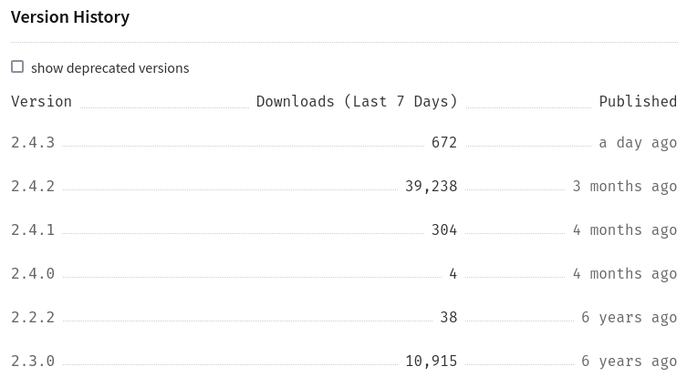

I planned the next post as the release announcement of Metalsmith 2.5, but some release features were tougher than I antipicated.
I'm almost there though, so bear with me. In the meantime, I'm bringing you an overview of the tons of other updates in the first 4 months of 2022 in the metalsmith ecosystem.

## Metalsmith is growing

First off, metalsmith has been seeing some steady growth on NPM: the 2.4.x releases have been **installed 4x as much** in 4 months
as the last stable release had in 6 years!

<figure>
  
  <figcaption><a href="https://www.npmjs.com/package/metalsmith">NPM stats</a> on 2022, May 18th</figcaption>
</figure>

## New plugins

3 revamped/ new core plugins:

* [@metalsmith/postcss](https://github.com/metalsmith/postcss) was adopted and updated from the older [metalsmith-postcss](https://github.com/axa-ch/metalsmith-postcss). It now also supports source maps for builds using [@metalsmith/sass](https://github.com/metalsmith/sass).
* The new [@metalsmith/requests](https://github.com/metalsmith/requests) plugin allows you to fetch content from other sites and API's and attach them to metadata or file contents. Ideal for aggregating data or connecting a headless CMS to the metalsmith build.
* The old [metalsmith-metadata](https://npmjs.com/package/metalsmith-metadata) plugin has moved to [@metalsmith/metadata](https://github.com/metalsmith/metadata) and was updated to be more powerful and consistent.

[14 community plugins](/plugins/?search=emmercm) by [emmercm](https://github.com/emmercm) were also updated and added to the plugin registry.

## New metalsmith starter repo's

[Werner Glinka](https://github.com/wernerglinka) has become co-maintainer for some parts of the metalsmith core repositories (website, plugin registry, remove plugin, more to come). He is a long-time metalsmith (professional) user and has contributed a lot in the way of exchanging ideas, reviewing and creating metalsmith starters:

* **[wernerglinka/metalsmith-bare-bones-starter](https://github.com/wernerglinka/metalsmith-bare-bones-starter)**: Bare-bones metalsmith starter with markdown & Nunjucks templating | **[Demo](https://metalsmith-bare-bones-starter.netlify.app/)**
* **[wernerglinka/metalsmith-blog-starter](https://github.com/wernerglinka/metalsmith-blog-starter)**: Blog metalsmith starter with markdown & Nunjucks templating + a landing page & some sample articles | **[Demo](https://metalsmith-blog-starter.netlify.app/)**
* **[wernerglinka/metalsmith-company-starter](https://github.com/wernerglinka/metalsmith-company-starter)**: Company site starter with markdown & Nunjucks templating | **[Demo](https://metalsmith-company-starter.netlify.app/)**

## Website updates

* The [plugins registry](/plugins) now also searches on user name and supports a `search` parameter: for example [https://metalsmith.io/plugins/?search=metalsmith](https://metalsmith.io/plugins/?search=metalsmith) will display all core plugins first.

Last but not least: Metalsmith 2.5 should be ready for the end of May, and the new docs will soon replace the front-page docs :)  
Cheers!
